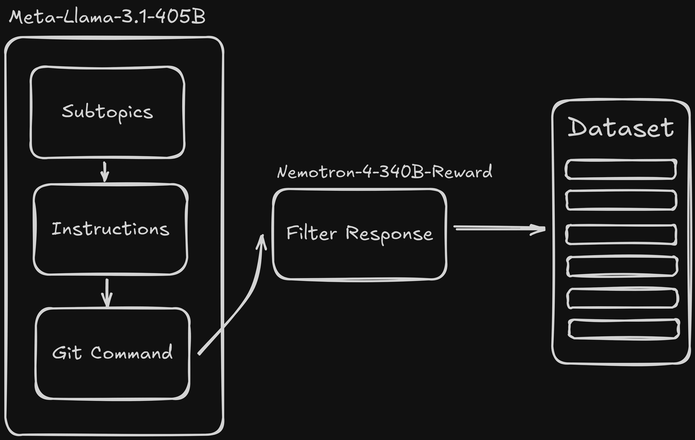

# Creating Synthetic Dataset Using Llama 3.1 405B and Nemotron 4

In this notebook we will use the following structure to create a synthetic dataset of Intructions and Git Commands.

We will create a set of instructions related to git queries in natural language, then we will generate the response for each instruction. 

The instruction/response pairs will be passed to a reward model, Nemotron 4, to filter out any bad pairs. 

Finally, the dataset will be pushed to HuggingFace. 

## Dataset
The final work can be viewed here:
https://huggingface.co/datasets/hesamsheikh/git-prompt